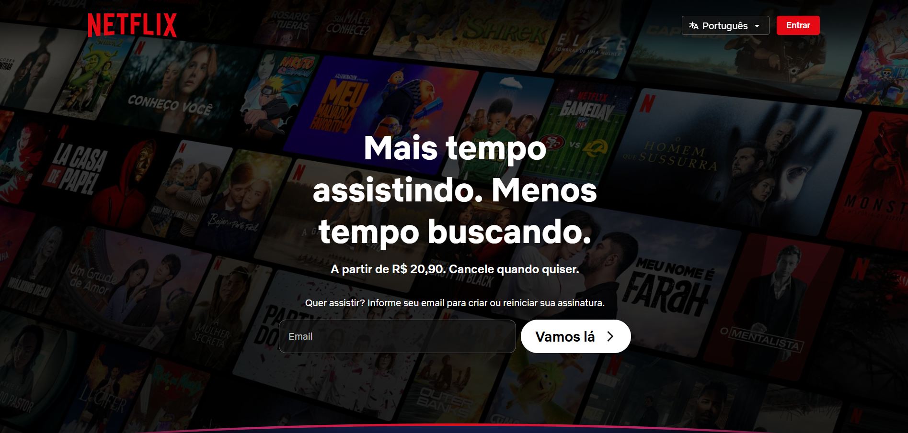
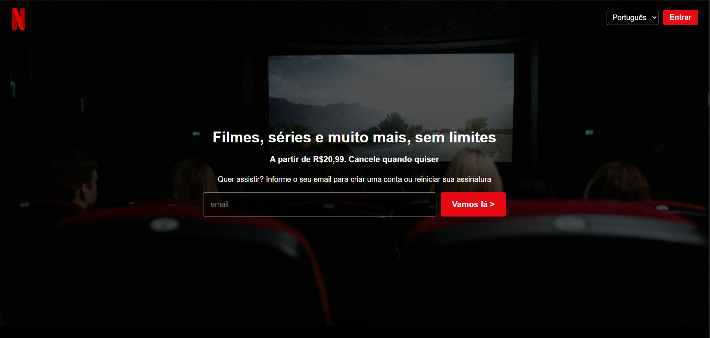
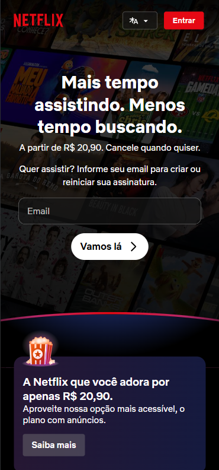
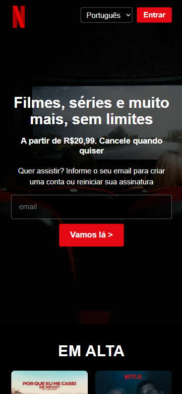

# Clone da Netflix

**Aluno:** Alan Gabriel  
**Matrícula:** 1135335  
**Site de referência:** https://www.netflix.com/br/  
**Página publicada:** [\[adicionar link do GitHub Pages](https://alangodoii.github.io/pagecustomNetflix/)

---

## Sobre o projeto

Projeto desenvolvido para a disciplina de Front-End com o objetivo de reproduzir visualmente a página inicial da Netflix utilizando HTML e CSS.

O projeto foi desenvolvido utilizando HTML semântico, CSS responsivo, Flexbox, CSS Grid e boas práticas de acessibilidade.

Como funcionalidade adicional, foi utilizado JavaScript na seção de perguntas frequentes, permitindo que ao abrir uma pergunta, a anterior seja fechada automaticamente.

---

## Análise da página original

A página inicial da Netflix possui uma estrutura dividida em diferentes seções.

O cabeçalho contém o logotipo da Netflix, o seletor de idioma e o botão de entrada.

A seção principal apresenta uma imagem de fundo, título, textos informativos e um formulário para inserção de email.

Também estão presentes seções de conteúdos em alta, motivos para assinar, perguntas frequentes, chamada final e rodapé.

Para reproduzir essa estrutura foram utilizadas tags semânticas como:

- `header`
- `nav`
- `main`
- `section`
- `article`
- `footer`

---

## Checklist dos critérios

### 1.1 HTML semântico e acessível

- Utilização de `header`, `nav`, `main`, `section`, `article` e `footer`
- Imagens com atributo `alt`
- Formulários com `label` associado aos campos
- Hierarquia de títulos organizada

### 1.2 Fidelidade visual

O layout foi desenvolvido buscando manter características semelhantes à página original da Netflix, como:

- Fundo predominantemente preto
- Cor vermelha característica da Netflix
- Hero com imagem de fundo
- Formulário de email
- Cards de conteúdos
- Cards de benefícios
- Perguntas frequentes
- Rodapé com links

Algumas imagens e conteúdos foram adaptados para fins acadêmicos.

### 1.3 CSS: seletores, box model e variáveis

Foram utilizados diferentes tipos de seletores CSS:

- **Classe:** `.hero`
- **Descendente:** `.hero h1`
- **Pseudo-classe:** `.botao-entrar:hover`

Também foram utilizadas variáveis no `:root` para armazenar cores e outros valores utilizados no projeto.

O `box-sizing: border-box` foi aplicado globalmente para facilitar o controle dos tamanhos dos elementos.

### 1.4 Responsividade

O projeto foi desenvolvido utilizando a abordagem mobile first.

Foram utilizados:

- Flexbox
- CSS Grid
- Media Query com `min-width`
- Layout adaptado para celular e desktop

No celular, os elementos são reorganizados para facilitar a visualização e utilização da página.

### 1.5 Personalização e originalidade

Como elementos adicionais ao site original foram adicionados:

- Seção "Sobre este clone"
- Rodapé autoral
- JavaScript no FAQ para controlar a abertura das perguntas

---

## Funcionalidade extra com JavaScript

Foi implementada uma interação na seção de perguntas frequentes.

Quando uma pergunta é aberta, qualquer outra pergunta que esteja aberta é automaticamente fechada.

Essa funcionalidade foi desenvolvida utilizando JavaScript.

---

## Comparativo visual

### Desktop

| Página original | Meu clone |

|  |  |

### Mobile

| Página original | Meu clone |

|  |  |

---

## Tecnologias utilizadas

- HTML5
- CSS3
- JavaScript
- Git
- GitHub

## Autor

Desenvolvido por **Alan Gabriel** para fins acadêmicos.